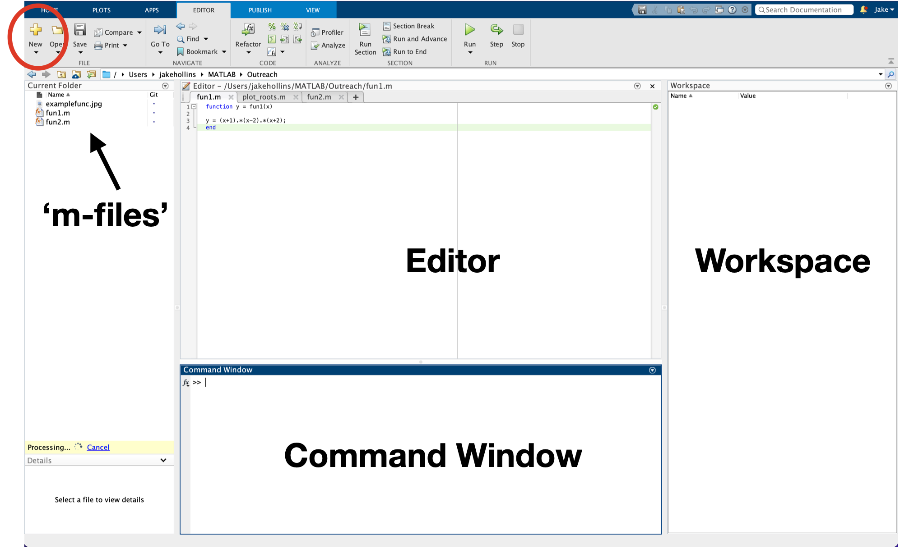

## Learning Objectives
- Familiarise with the MATLAB graphical user interface (GUI).
- Perform basic calculations in the command window
- Assign variables
- Write a function  

## MATLAB GUI
MATLAB software allows the user to write code, but essentially MATLAB acts like a glorified calculator. If you open up MATLAB, you
will see the screen shown below. If the Editor is not shown, click the yellow ‘+’ circled in red.

.

