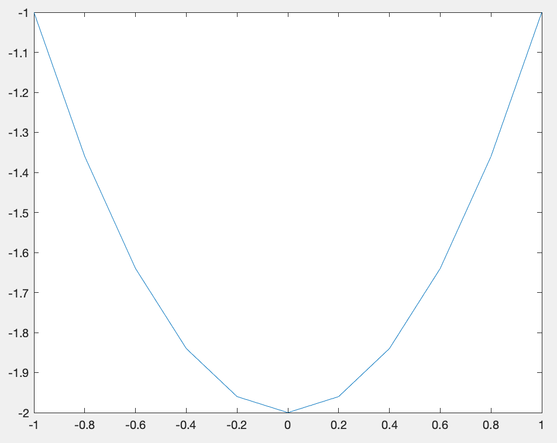
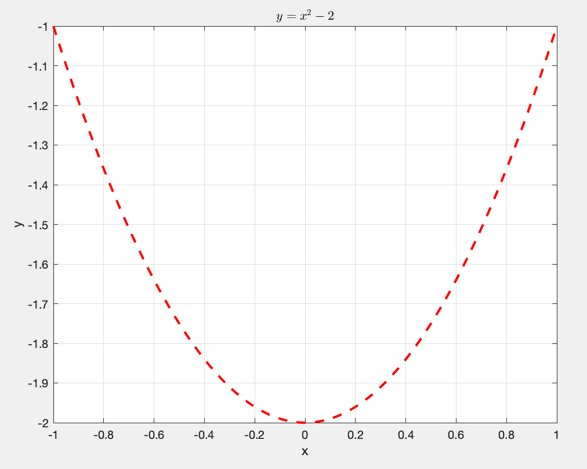
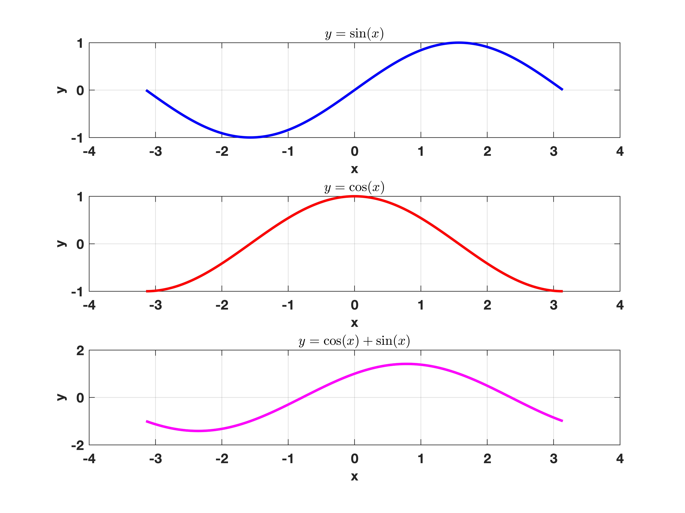
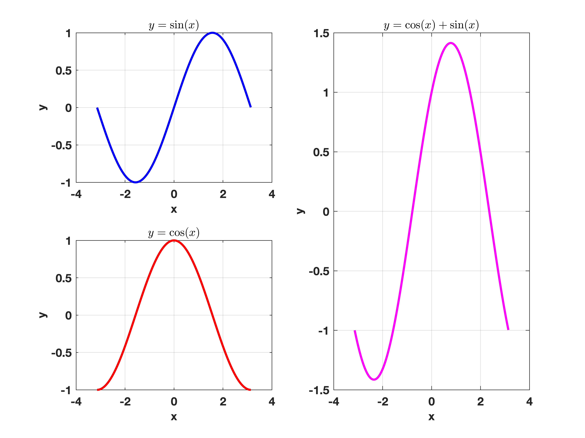

## First Graph
Plotting in MATLAB is relatively straightforward once you are aware of the basics. Let's start with line graphs and plotting $y = x^2-2$ between -1 and 1.

Use the code below to create the data for the plot:
```
x = -1:0.2:1;  % Create a row vector of the input numbers we wish to evaluate
y = x.^2-2;    % Create a row vector of the output numbers we wish to plot
```

Now we can use the `plot` function in MATLAB to sort the rest:
```
figure(1)  % this line isn't necessary
plot(x,y)  % plots x and y data
```
You should get a graph that looks like this:

As you can see, the lines are a bit jagged. **Adjust the step size in $x$ so that the line becomes smoother**

## Graph settings
MATLAB offers plenty of customisation which can help improve how our graphs look. For example, within the `plot` function, we can change the appearance of the line:
```
plot(x,y,'r--',LineWidth=2)   % creates dashed red line with thicker line width.
```
We can also add a grid and label the axes and title, but ensure that the text is in apostrophes(`'`):
```
grid on                                    % adds a grid to background
xlabel('x')                                % labels bottom axes
ylabel('y')                                % labels side axes
title('$y = x^2 -2$',Interpreter='latex')  % adds title using a LaTeX interpreter
```
**Top Tip: If using a latex interpreter, use the dollar sign (`$`) either side of the maths.**



**Check out the MATLAB  page for more information.**

The MATLAB website provides a comprehensive guide to its in-built functions which is extremely helpful when stating out coding.

## Task 3a
Create a script that replicates the following graph for $y = 4x^2 -x +5$:


## Multiple plots
Sometimes we may want to plot on the same figure. This is commonly completed in two ways: using `hold` or `subplot`.

### hold
Let's consider the sine and cosine functions we wish to plot on the same figure: $y = \sin(x)$ and $y= \cos(x)$. We could easily create a matrix with the output data with the following code: 
```
% Create data
x = -pi:0.01:pi;
y = [sin(x); cos(x)];

% plot data
p = plot(x,y);
grid on
xlabel('x'), ylabel('y')
legend('sin(x)','cos(x)',Location='NorthWest')

p(1).LineWidth = 2;      % Changes LineWidth of first dataset
```
This works well when the output data is the same length. Sometimes we wish to overlay onto an existing figure, which can be done using `hold`. Here is another example:
```
figure(2)
x = -pi:0.01:pi;
y1 = sin(x); y2 = cos(x);

% first plot
plot(x,y1,'r-')
grid on
xlabel('x'), ylabel('y')
hold on                  % holds plot so nothing is overwritten

% second plot 
plot(x,y2,'b-*')
hold off                 % takes hold off.

legend('sin(x)','cos(x)',Location='NorthWest')
```

**Try this yourself using $y = 2\sin(x)$ and $y = x^3 + 4x -3$**

### Subplots
Subplots enable you to have multiple plots on the same figure. This can make presenting information/data related to each other much easier to read, ideal in publications.
To get two plots side-by-side, use the following command:
```
x = -pi:0.01:pi;
y1 = sin(x); y2 = cos(x);

figure(3)
subplot(1,2,1)            % Creates subplot ( 1 row, 2 columns), and plots at 1st position
plot(x,y1)
grid on
xlabel('x'), ylabel('y')
title('$y = \sin(x)$',Interpreter = 'Latex')

subplot(1,2,2)           % Creates subplot ( 1 row, 2 columns), and plots at 2nd position
plot(x,y2)
grid on
xlabel('x'), ylabel('y')
title('$y=\cos(x)$',Interpreter = 'Latex')
```

**By modifying the above code, assign a new variable `y3 = y1 + y2`. and create a subplot of the 3 plots (`y1`, `y2`, `y3`) arranged vertically**


> >### Solution
> > ```
> > x = -pi:0.01:pi;
> > y1 = sin(x); y2 = cos(x); y3 = y1 + y2;
> > figure(4)
> > subplot(3,1,1)            % Creates subplot ( 3 rows, 1 column), and plots at 1st position
> > plot(x,y1,'b',LineWidth=2)
> > grid on
> > xlabel('x'), ylabel('y')
> > title('$y = \sin(x)$',Interpreter = 'Latex')
> > 
> > subplot(3,1,2)           % Creates subplot ( 3 rows, 1 column), and plots at 2nd position
> > plot(x,y2,'r',LineWidth=2)
> > grid on
> > xlabel('x'), ylabel('y')
> > title('$y=\cos(x)$',Interpreter = 'Latex')
> > 
> > subplot(3,1,3)           % Creates subplot ( 3 rows, 1 column), and plots at 3rd position
> > plot(x,y3,'m',LineWidth=2)
> > grid on
> > xlabel('x'), ylabel('y')
> > title('$y=\cos(x)+\sin(x)$',Interpreter = 'Latex')
> > ```
> > {: .solution}
> {: .challenge}

We can even do 2-dimensional grids for plots. What's more, we can overlay plots over neighbouring grids by selecting the correct indices:
```
subplot(2,2,[2,4])
plot(x,y3)
```
** Adapt the above code to produce the following graph:**

