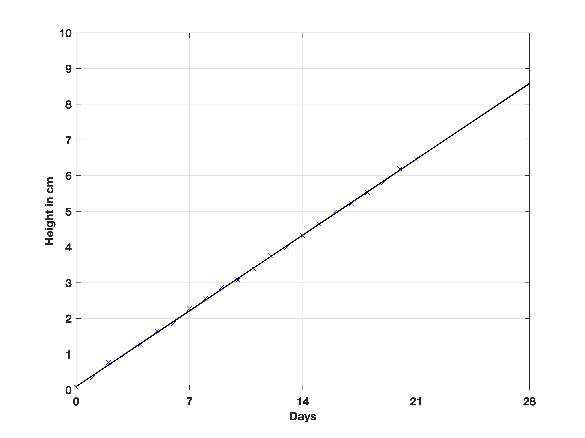

# Learning Objectives
- Learn how to perform linear regression
- Expand methods to include up to third order polynomials
- Practice using functions to clean code.

# Regression
Regression allows us to make relationships between variables. For example, see the graph below on how the sunflower height increases over several weeks:


How much do we expect the sunflower to grow each day? How tall is the sunflower likely to be by day 28?

To answer these questions, one may plot a "line of best-fit", which is a regression line describing the relationship between days and height:



Here, the line of best fit shows that by day 28, we predict the height of the sunflower to be approximately 8.5 cm. We can also inspect the gradient to be 0.3 cm/day, which is the average growth.

# Formulating Polynomial Lines
This straight line is formulated using:
$ y = c + m_1x $

where $x$ is the input, $c$ the intercept, $m_1$ is the gradient, and $y$ the output. This is a first-order polynomial and can also be written in matrix form as:

```
y = [1,x]*[c; m]
```
This works for 1 output, but we can do any number of inputs and outputs with additional rows. Take this code for $y = 1 + 2x$ when $x = 2,3,4$:
```
x1 = 2; x2 = 3; x3 = 4;
c = 1; m = 1; 
y = [1,x1;1,x2;1,x3]*[ c; m]
```
This can be also generalised for any order such as second-order ($y = c + m_1 x + m_2 x^2$):
```
x = 2;
c = 1; m1 = 2; m2 = 1;
y = [1,x,x.^2]*[c; m1; m2]
```
and for multiple rows:
```
x = [0:10]';
ones_col = ones([length(x),1])
c = 1; m1 = 2; m2 = 1;
y = [ones_col,x,x.^2]*[c; m1; m2]
```

# Formulating Regression Lines
So we've just seen a good method of creating lines when we know the coefficients ($c$, $m_1$...), but often we have the data and want to find a relationship.

To simplify notation, let's set $X = [1, x_1, ... x_n]$. Through linear algebra, we can solve for the coefficients using the following formula:
$(X'X)^{-1} X' y$ where the apostrophe (`'`) is the transpose of the matrix. Don't worry, in MATLAB we will type this:
```
(X'X)^(-1) * X' * y
```
Here's the example for the sunflower graph above:
```
days = [0:21]';  % day data
height = [0.07,0.33,0.76,1.00,1.27,1.66,1.85,2.27,2.56,2.87,3.07,3.38,3.77,3.99,4.31,4.64,4.99,5.21,5.53,5.81,6.19,6.4700]'; % height data

X = [ones([22,1]),days];  % X matrix;

coefficients = (X'*X)^(-1) * X' * height  % displays coefficients for line of best fit 
```
This should get about 0.08 for $c$ and 0.3 for $m_1$. To draw the line of best fit, we can adapt the polynomial regression code:
```
x = [0:0.1:28]';
X = [ones([length(x),1]),x];

y = X * coefficients;

% plot line of best fit
figure()
plot(X(:,2), y,'k-')
xlabel('Days'), ylabel('Height in cm')

% plot points too
hold on
plot(days,height,'bx')
hold off
```
