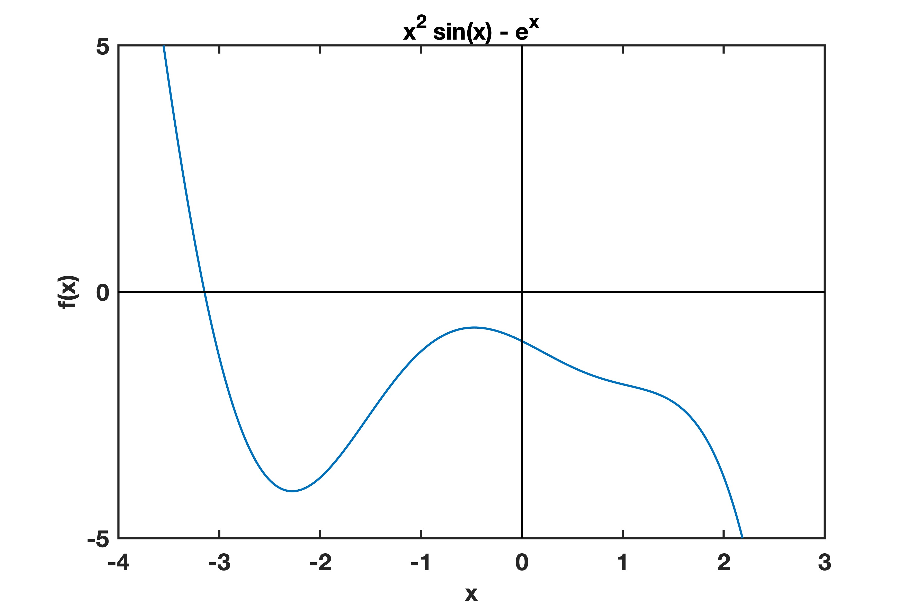
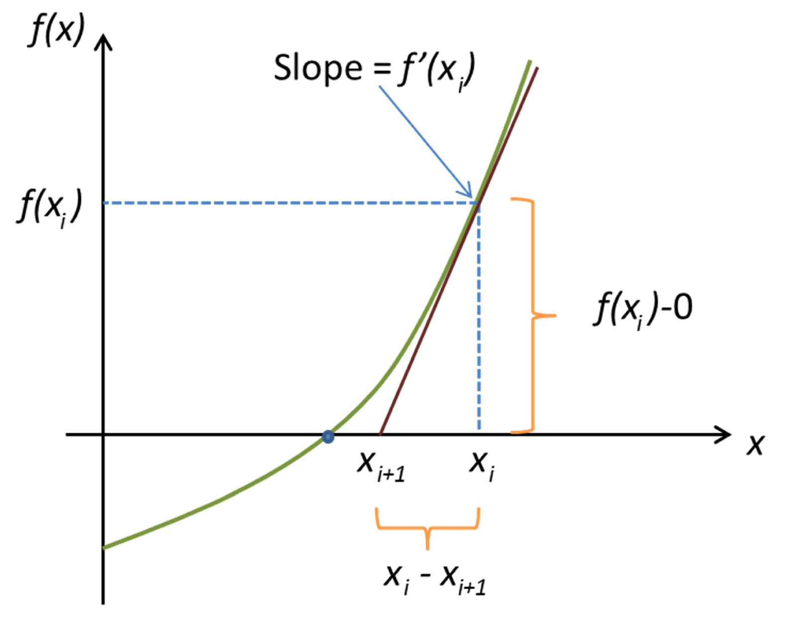
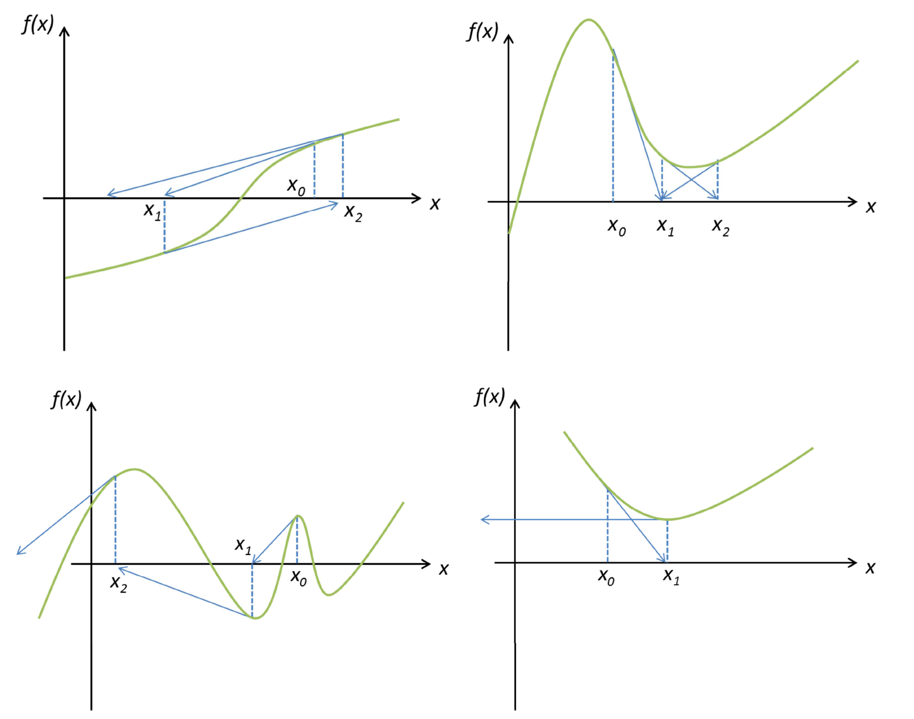

# Learning Objectives
- Practice optimisation and how algorithms can reduce computation time
- Apply optimisation techniques to root finding.

# Optimisation
Optimisation is another important skill which underlies many data analysis techniques. This area is vast so will use a relatively easy example to show how algorithms can significantly reduce the computation time. 

Today we will focus on finding roots using two different algorithms: bisection and Newton-Raphson.

# Bisection
The below graph shows the equation $y = x^2 \sin(x) - e^x$.


One method of finding the root of an equation is bisection. When there is a root, there typically is a change of
sign (positive to negative). Looking at our example equation from above, we can see that the function has a root
about x = −3.
A bisection algorithm takes two points, x0 and x2, and finds the midpoint, x1.
If there is a change of sign when we evaluate these values, there is a root within these boundaries. below is one implementation of the bisection method:

```
function [root,error,iterations] = find_root(initial_x,fun)
error = 1;
tolerance = 0.01;
x = initial_x;
delta_x = 1.0001;
iterations = 0;
while error > tolerance && iterations < 10000
    iterations = iterations+1;
    y0 = fun(x);
    y1 = fun(x+delta_x);
    y2 = fun(x+2*delta_x);

    if y0/y1 < 0
        delta_x = delta_x/2;
        error = abs(delta_x/(x+delta_x));
    elseif y2/y1 < 0
        delta_x = delta_x/2;
        error = abs(delta_x/(x+delta_x));
        x = x+delta_x;
    else 
        x = x+2*delta_x;
    end
end

root = x;
end
```

### Task 9a
Using the line coefficients from the projectile question **(8b)**, create a function which takes an input time and outputs the displacement.

### Task 9b
Use the bisection method from above to find roots. Try different values of `intitial_x` and `tolerance` and see how this affects the answer.

# Newton-Rapson
This is the most widely used of all root-locating formulas. One way of deriving the Newton-Rhapson formula is by graphical derivation:


The Newton-Rapson method is given as:
$x_{i+1} = x_i -   \frac{f(x_i)}{f'(x_i)}$

where $f'(x)$ is the derivative or gradient of function $f(x)$, $x_{i+1}$ is the next best guess for the root, and $x$ is the current guess for the root. This process can repeat many times to find a root to greater accuracy. normally we only care about a certain degree of accuracy! 

This equation assumes we know the gradient of the function. If this is not known, then we can approximate
by taking a small step, ∆, in either direction and calculating the gradient (for example ∆ = 0.001):
$f'(x_i) = \frac{f(x+\Delta) -f(x-\Delta)}{2 \Delta}$

Below is a working implementation of the Newton-Rapson method.
```
function [root,error,iterations] = NewtonRaphson(initial_x,fun)

error = 1;
tolerance = 0.00001;
x = initial_x;
delta_x = 0.001;
iterations = 0;

while error > tolerance && iterations <100
    iterations = iterations + 1;
    est_grad = (fun(x+delta_x)-fun(x-delta_x))/(2*delta_x);
    x_new = x - fun(x)/est_grad;
    error = abs(x-x_new);
    x = x_new;
end

root = x;
end
```

### Task 9c
Try the Newton-Rapson method with the same function. Compare how quickly the roots are found by the number of iterations compared to the bisection method.

# When Newton-Rapson breaks down
Sometimes algorithms break down. Below shows some cases when Newton-Rapson breaks down.


### Task 9d
How might you address bad initial guesses, and how can we sure of how many roots there are? 

### Bonus
Try your idea with the following function:
```
function y = fun1(x)
y = (x+1).*(x-2).*(x+2);
end
```
